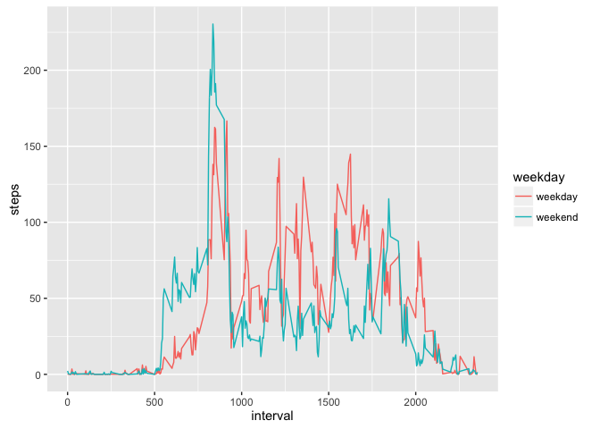

# Reproducible Research: Peer Assessment 1


## Loading and preprocessing the data

```r
library(sqldf)
library(ggplot2)
week2_data <- read.table("./activity.csv", sep = "," , header = T, quote = "\"")
```


## What is mean total number of steps taken per day?

```r
steps_daily <- aggregate(steps ~ date, week2_data, FUN = sum)
mean(steps_daily$steps)
```

```
## [1] 10766.19
```

## What is the average daily activity pattern?

```r
steps_interval <- aggregate(steps ~ interval, week2_data, FUN = mean)
with(steps_interval, plot(interval, steps, type = 'l'))
```

<!-- -->

## Imputing missing values

```r
steps_interval_mean <- aggregate(steps ~ interval, week2_data, FUN = mean, na.rm = T)
week2_data_clean <- sqldf("select ifnull(w2.steps, sm.steps) as steps, w2.date, w2.interval from week2_data as w2 join steps_interval_mean as sm on w2.interval = sm.interval ")
steps_daily_clean <- aggregate(steps ~ date, week2_data_clean, FUN = sum)
```

## Are there differences in activity patterns between weekdays and weekends?

```r
week2_data_clean$weekday <- ifelse(weekdays(as.Date(week2_data_clean$date)) %in% c("Sunday", "Saturday"), "weekday", "weekend")
steps_interval_weekday <- sqldf("select weekday, interval, avg(steps) as steps from week2_data_clean group by weekday, interval")
qplot(interval, steps, data = steps_interval_weekday, color = weekday, geom = "line")
```

<!-- -->
